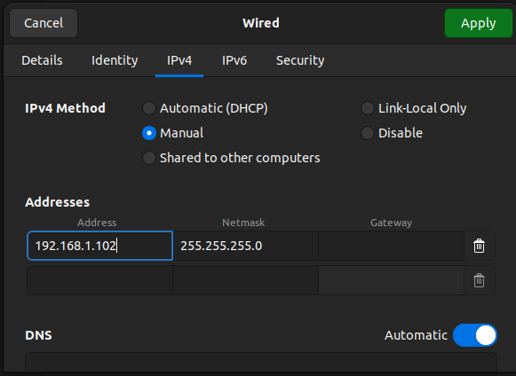

# TESTING ROBOSENSE (Ubuntu 20.04, Ros2 Humble)


## Configuración 

1. Conectar RJ45 de `robosense` a ordenador para testear

2. Asignar la siguiente `IP` al ordenador de testeo:




## Uso de SDK ROBOSENSE

Dentro del workspace en el que se quiera trabajar, dentro de `src` realizar los siguientes pasos:

1. Clonar este repositorio y obtener `rs_driver` mediante `submodule`:

```sh
git clone https://github.com/inakilorentekivnon/rslidar_sdk/tree/ros2
cd rslidar_sdk
git submodule init
git submodule update
```


2. Instalar dependencias (en caso de no estar instaladas):

```sh
sudo apt-get update
sudo apt-get install -y libyaml-cpp-dev
```


```sh
sudo apt-get install -y  libpcap-dev
```

3. Obtener `rslidar_msg` (rama release):

```sh
git clone -b release https://github.com/RoboSense-LiDAR/rslidar_msg
```
4. Compilar:

```sh
colcon build --symlink-install
```
